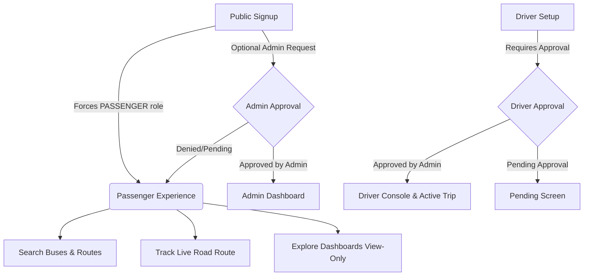
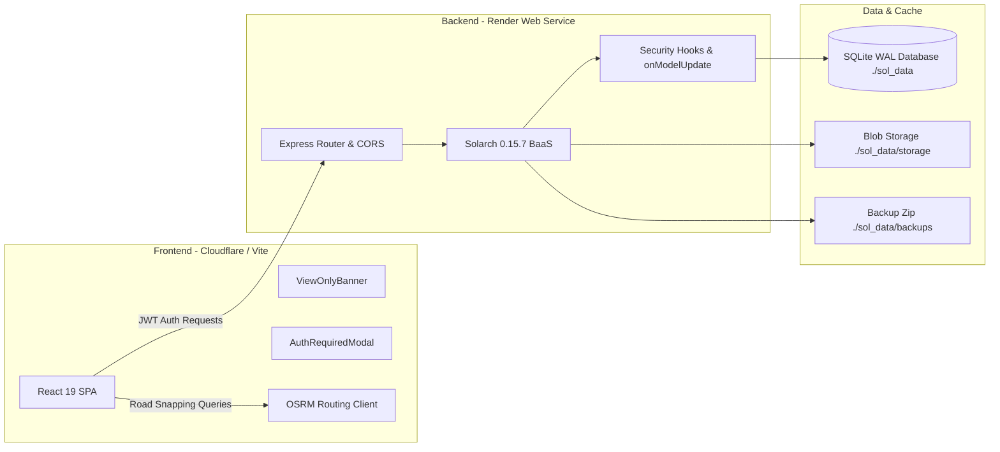
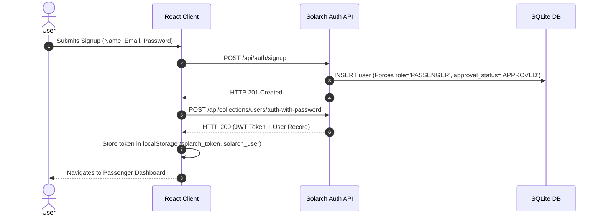

# SmartTransit

SmartTransit is a modern, real-time public transit tracking and fleet management platform engineered for small and medium cities. It bridges the communication gap between transit authorities, drivers, and daily commuters by transforming standard driver smartphones into live GPS telemetry beacons—completely eliminating the need for expensive proprietary vehicle hardware. Built on a high-performance Solarch 0.15.7 backend with SQLite in WAL mode and a responsive React 19 + Vite frontend, SmartTransit provides road-accurate bus tracking, dynamic ETAs, administrative fleet control, and a dedicated View-Only exploration mode for evaluators and students.

---

## Table of Contents

- [Project Overview](#project-overview)
- [System Architecture](#system-architecture)
- [Core Features by Role](#core-features-by-role)
  - [Passenger Features](#passenger-features)
  - [Driver Features](#driver-features)
  - [Admin Features](#admin-features)
  - [View-Only / Demo Mode](#view-only--demo-mode)
- [Authentication System](#authentication-system)
- [Authorization & Security](#authorization--security)
- [Role Permission Matrix](#role-permission-matrix)
- [Map & OSRM Road Routing](#map--osrm-road-routing)
- [Technology Stack](#technology-stack)
- [Project Directory Structure](#project-directory-structure)
- [API Documentation](#api-documentation)
- [Environment Variables](#environment-variables)
- [Local Development Setup](#local-development-setup)
- [Deployment Architecture](#deployment-architecture)
- [SQLite Persistence & Render Storage](#sqlite-persistence--render-storage)
- [Backup & Restore System](#backup--restore-system)
- [Testing & Verification Results](#testing--verification-results)
- [Production Build Status](#production-build-status)
- [Known Limitations](#known-limitations)
- [Project Roadmap](#project-roadmap)
- [Troubleshooting Guide](#troubleshooting-guide)
- [Security Reporting](#security-reporting)
- [License & Credits](#license--credits)

---

## Project Overview

### Problem
In many developing urban centers and Tier-2/Tier-3 cities, public bus networks operate unpredictably without live schedule visibility. Commuters suffer prolonged wait times and overcrowded stops, while transport operators face prohibitive capital expenditure ($300–$800+ per bus) to install and maintain dedicated GPS telematics hardware.

### Solution
SmartTransit delivers an end-to-end software platform that utilizes the driver's mobile device via native HTML5 Geolocation to stream high-precision telemetry. Real-time updates are processed by a lightweight Solarch backend and streamed directly to passengers through interactive Leaflet maps with road-following OSRM geometry.

### Target Users & Primary Workflows


---

## System Architecture



---

## Core Features by Role

### Passenger Features
- **Bus & Route Discovery**: Search active buses and scheduled routes with fuzzy typo tolerance (`fuzzySearch.js`).
- **Live Road-Snapped Tracking**: Real-time Leaflet map tracking (`TrackBus.jsx`) displaying bus location markers, active stops, and road-following geometry.
- **Route Stop Sequence**: Ordered station timeline showing departure and arrival stations with ETA estimation.
- **Explore Dashboards**: Quick access banner to preview Driver and Admin dashboards in safe View-Only mode.

### Driver Features
- **Assigned Vehicle Console**: Displays assigned bus information (`DriverDashboard.jsx`), route details, and trip duration metrics.
- **Single-Click Trip Activation**: Initiate active transit sessions with one click, transitioning trip state to `IN_PROGRESS`.
- **GPS Telemetry Streaming**: Streams live coordinates, speed (km/h), and timestamps to backend `live_locations` collection via HTML5 Geolocation (`ActiveTrip.jsx`).
- **Trip Lifecycle Management**: Clean completion and termination of active trips with confirmation dialogs.

### Admin Features
- **Fleet & Bus Management**: Monitor all fleet vehicles, status indicators, and assignments (`BusesManagement.jsx`).
- **Driver Approvals**: Review, approve, or reject pending driver onboarding applications (`DriverApprovals.jsx`).
- **Admin Candidate Approvals**: Review pending admin privilege requests and approve candidates with server-enforced quota control (`AdminSettings.jsx`).
- **City-Wide Live Fleet Map**: Interactive administrative map monitoring all active buses across city routes simultaneously (`LiveMap.jsx`).
- **System Settings**: Toggle platform-wide driver approval mandates and inspect administrative metadata.

### View-Only / Demo Mode
- **Purpose**: Enables passengers, evaluators, and students to explore Driver and Admin dashboards without compromising backend security or creating separate test accounts.
- **Sticky Banner (`ViewOnlyBanner.jsx`)**: Displays `"Viewing Driver/Admin Dashboard — View Only"` at the top with a `"Back to Passenger"` exit action.
- **Action Guarding (`AuthRequiredModal.jsx`)**: Clicking privileged buttons (e.g., *Start Trip*, *Add Driver*, *Approve Driver*, *Approve Admin*, *Save Settings*) intercepts the action with a modal explaining required role privileges.
- **Strict Authority**: The backend evaluates the real cryptographic JWT role. Client-side viewing mode grants zero backend privileges.

---

## Authentication System

SmartTransit uses standard JSON Web Tokens (JWT) signed with a secret of at least 32 characters (`SOLARCH_JWT_SECRET`).



### Core Authentication Rules
1. **Public Signup**:
   - Always creates `role = 'PASSENGER'` and `approval_status = 'APPROVED'`.
   - Client cannot set `role = 'ADMIN'` or `role = 'DRIVER'`.
2. **Admin Access Request**:
   - Signup with admin request creates `role = 'PASSENGER'` and `admin_request = 'PENDING'`.
   - Requires an authenticated `ADMIN` to approve via `/api/admin/requests/:id/approve`.
3. **Driver Workflow**:
   - Driver accounts require administrative approval before starting trips.
4. **Logout Lifecycle**:
   - Purges `solarch_token` and `solarch_user` from browser storage.
   - Clears all UI authentication error states.
   - Database record remains intact in SQLite.

---

## Authorization & Security

Frontend route guards (`ProtectedRoute.jsx`) serve solely as user-interface navigation controllers. **The Solarch backend remains the sole authoritative security boundary.**

### Security Controls Implemented
- **Model Hook Protection (`onModelUpdateExecute`)**: Intercepts `users` collection updates and strips unauthorized mutations to `role`, `approval_status`, and `admin_request` from non-admin tokens.
- **Dedicated Admin Endpoints**: `/api/admin/requests/:id/approve` and `/reject` cryptographically verify the requester's JWT signature and `role === 'ADMIN'`.
- **10-Admin Server Cap**: Server enforces a maximum limit of 10 active administrators. Further approvals are rejected with HTTP 400.
- **Password Security**: Passwords hashed with `bcrypt` using 12 salt rounds.
- **CORS Protection**: Restricted to configured origins (`CORS_ORIGIN` / `CORS_ALLOWED_ORIGINS`).

### Verified Security Test Matrix
| Security Scenario | Initiator | Expected Result | Verified Result | Status |
| :--- | :---: | :---: | :---: | :---: |
| **Tamper Signup Role to ADMIN** | Public | Set to `PASSENGER` | `role='PASSENGER'` | **PASS** |
| **Tamper Signup Role to DRIVER** | Public | Set to `PASSENGER` | `role='PASSENGER'` | **PASS** |
| **PATCH User Role to ADMIN** | Passenger | Overridden by Hook | Role remains `PASSENGER` | **PASS** |
| **PATCH User Role to DRIVER** | Passenger | Overridden by Hook | Role remains `PASSENGER` | **PASS** |
| **Admin Endpoint without JWT** | Anonymous | HTTP 403 Forbidden | HTTP 403 Forbidden | **PASS** |
| **Admin Endpoint with Passenger Token** | Passenger | HTTP 403 Forbidden | HTTP 403 Forbidden | **PASS** |
| **Admin Endpoint with Driver Token** | Driver | HTTP 403 Forbidden | HTTP 403 Forbidden | **PASS** |
| **Admin Endpoint with Valid Admin Token** | Admin | HTTP 200 OK | HTTP 200 OK | **PASS** |
| **10-Admin Quota Limit** | Admin | Block 11th admin | Blocked with HTTP 400 | **PASS** |

---

## Role Permission Matrix

| Feature / Action | Passenger | Driver | Admin | View-Only Mode |
| :--- | :---: | :---: | :---: | :---: |
| **View Passenger Home & Bus Search** | Full | Full | Full | Full |
| **View Live Track Map** | Full | Full | Full | Full |
| **View Driver Dashboard** | View-Only | Full | Full | View-Only |
| **Start / End Bus Trips** | Denied (Modal) | Full | Denied | Denied (Modal) |
| **Submit Live GPS Telemetry** | Denied (403) | Full | Denied (403) | Denied (Modal) |
| **View Admin Dashboard & Metrics** | View-Only | View-Only | Full | View-Only |
| **Register New Drivers** | Denied (Modal) | Denied (Modal) | Full | Denied (Modal) |
| **Approve / Reject Drivers** | Denied (Modal) | Denied (Modal) | Full | Denied (Modal) |
| **Approve / Reject Admin Requests** | Denied (Modal) | Denied (Modal) | Full | Denied (Modal) |
| **Modify Platform Settings** | Denied (Modal) | Denied (Modal) | Full | Denied (Modal) |

---

## Map & OSRM Road Routing

SmartTransit integrates Leaflet with the Open Source Routing Machine (OSRM) to calculate realistic road-snapped bus paths across urban roads.

```mermaid
sequenceDiagram
    autonumber
    participant UI as TrackBus / ActiveTrip Map
    participant OSRM_Lib as src/lib/osrm.js
    participant API as Public OSRM Service

    UI->>OSRM_Lib: fetchRoadSnappedRoute(stops)
    OSRM_Lib->>OSRM_Lib: Check in-memory route cache
    alt Cache Hit
        OSRM_Lib-->>UI: Return cached [lat, lon] geometry
    else Cache Miss
        OSRM_Lib->>API: GET /route/v1/driving/lon1,lat1;lon2,lat2...
        alt Routing Succeeded
            API-->>OSRM_Lib: 200 OK (GeoJSON coordinates)
            OSRM_Lib->>OSRM_Lib: Convert [lon, lat] -> [lat, lon] and cache
            OSRM_Lib-->>UI: Render road-following polyline
        else Routing Failed / Timed Out
            OSRM_Lib-->>UI: Return null
            UI->>UI: Show stop markers only (NO straight lines)
            UI->>UI: Display "Route temporarily unavailable" + [Retry] button
        end
    end
```

### Zero-Fabrication Routing Policy
- **Accurate Roads**: When OSRM responds, geometry adheres strictly to roadways.
- **Zero Fabrication**: If OSRM is unavailable, times out, or fails, **no artificial straight lines are drawn across buildings or private land**. Stop markers remain visible with an informational banner and manual **Retry** action.
- **Public OSRM Service Notice**: Default routing uses the public OSRM demonstration server (`https://router.project-osrm.org`). For high-throughput commercial deployments, an enterprise OSRM or Valhalla instance should be hosted.

---

## Technology Stack

| Layer | Technology | Version | Purpose |
| :--- | :--- | :--- | :--- |
| **Frontend Framework** | React | `19.2.8` | Component-based user interface |
| **Build Tool & Bundler** | Vite | `8.2.1` | Fast HMR dev server & production bundler |
| **Client Router** | React Router DOM | `7.18.2` | Single Page Application client routing |
| **Styling & Design** | Tailwind CSS | `4.3.3` | Glassmorphism responsive design system |
| **Animation Engine** | Framer Motion | `13.1.0` | Micro-interactions and screen transitions |
| **Mapping Engine** | Leaflet / React-Leaflet | `1.9.4` / `5.0.0` | Interactive map rendering |
| **Icons** | Lucide React | `1.31.0` | Accessible SVG icon suite |
| **Backend Framework** | Solarch BaaS | `0.15.7` | Express-based BaaS runtime |
| **Database Engine** | SQLite (via `better-sqlite3`) | Embedded | Relational database in WAL mode |
| **Mobile Packaging** | Capacitor | `8.5.0` | Android wrapper (`@capacitor/android`) |

---

## Project Directory Structure

```text
transit/
├── backend/
│   ├── .env                       # Backend environment variables
│   ├── .env.example               # Backend template environment
│   ├── seed.js                    # Initial database seed script
│   └── server.js                  # Solarch BaaS server instance & security hooks
├── public/                        # Static public assets
├── scripts/
│   └── init-solarch-superuser.js  # Render deployment bootstrap script
├── src/
│   ├── components/
│   │   ├── AuthRequiredModal.jsx  # Modal guarding View-Only privileged actions
│   │   ├── ErrorBoundary.jsx      # React error boundary
│   │   ├── Sidebar.jsx            # Main drawer navigation & dashboard explorer
│   │   ├── SmartTransitLogo.jsx   # Vector application logo
│   │   └── ViewOnlyBanner.jsx     # Sticky view-only top status banner
│   ├── contexts/
│   │   └── SidebarContext.jsx     # Sidebar toggle state context
│   ├── hooks/
│   │   └── useAuth.jsx            # Authentication state & session manager
│   ├── lib/
│   │   ├── osrm.js                # OSRM road geometry client & in-memory cache
│   │   └── solarch.js             # Client SDK for Solarch REST API
│   ├── pages/
│   │   ├── admin/
│   │   │   ├── AddDriver.jsx        # Register new driver
│   │   │   ├── AdminDashboard.jsx   # Metrics, active trip summary, fleet links
│   │   │   ├── AdminSettings.jsx    # Admin candidate approvals & settings
│   │   │   ├── BusesManagement.jsx  # Bus fleet inventory
│   │   │   ├── DriverApprovals.jsx  # Driver registration approvals
│   │   │   └── LiveMap.jsx          # City-wide live bus monitoring map
│   │   ├── auth/
│   │   │   ├── Login.jsx            # Sign in screen with role demo switcher
│   │   │   ├── Profile.jsx          # User profile view & edit
│   │   │   └── Signup.jsx           # Public passenger registration
│   │   ├── driver/
│   │   │   ├── ActiveTrip.jsx       # Driver real-time trip GPS tracking console
│   │   │   ├── DriverDashboard.jsx  # Driver assigned bus console
│   │   │   ├── DriverSetup.jsx      # Driver profile completion
│   │   │   └── PendingApproval.jsx  # Driver pending verification screen
│   │   └── passenger/
│   │       ├── BusDetails.jsx       # Route stops timeline & vehicle info
│   │       ├── PassengerHome.jsx    # Bus search & dashboard explorer card
│   │       ├── PassengerMap.jsx     # Passenger map discovery view
│   │       └── TrackBus.jsx         # Live bus tracking with OSRM road route
│   ├── utils/
│   │   └── fuzzySearch.js         # Typo-tolerant search utility
│   ├── App.jsx                    # Application route definitions & guards
│   ├── index.css                  # Global Tailwind CSS styles
│   └── main.jsx                   # React entrypoint
├── index.html                     # HTML root
├── package.json                   # Project dependencies & scripts
├── vite.config.js                 # Vite build configuration
├── SMARTTRANSIT_RENDER_PERSISTENCE.md # Persistence audit & Render disk blueprint
└── README.md
```

---

## API Documentation

All API endpoints are hosted on the Solarch backend (default port `8090`).

### Authentication & User Endpoints
| Method | Endpoint | Description | Auth Required |
| :--- | :--- | :--- | :---: |
| `POST` | `/api/auth/signup` | Public user registration (Forces `PASSENGER`) | No |
| `POST` | `/api/collections/users/auth-with-password` | Authenticate user credentials & return JWT | No |
| `POST` | `/api/collections/users/auth-refresh` | Refresh user token and session state | Bearer JWT |
| `PATCH`| `/api/collections/users/records/:id` | Update profile (Protected fields stripped) | Bearer JWT |

### Admin Endpoints
| Method | Endpoint | Description | Role Required |
| :--- | :--- | :--- | :---: |
| `POST` | `/api/admin/requests/:id/approve` | Approve pending admin candidate (Cap: 10) | `ADMIN` |
| `POST` | `/api/admin/requests/:id/reject` | Reject pending admin candidate | `ADMIN` |

### Transit Collections (`/api/collections/:name/records`)
| Collection | Methods | Read Access | Write Access |
| :--- | :--- | :--- | :--- |
| `routes` | `GET`, `POST`, `PATCH`, `DELETE` | Public | `ADMIN` only |
| `stops` | `GET`, `POST`, `PATCH`, `DELETE` | Public | `ADMIN` only |
| `buses` | `GET`, `POST`, `PATCH`, `DELETE` | Public | `ADMIN` only |
| `trips` | `GET`, `POST`, `PATCH` | Public | `ADMIN` or Assigned `DRIVER` |
| `live_locations` | `GET`, `POST` | Public | Assigned `DRIVER` or `ADMIN` |

### System & Backup Endpoints
| Method | Endpoint | Description | Role Required |
| :--- | :--- | :--- | :---: |
| `GET` | `/api/backups` | List all existing `.zip` backup archives | Superuser |
| `POST` | `/api/backups` | Generate point-in-time `.zip` backup | Superuser |
| `GET` | `/api/backups/:key` | Download backup zip archive | Superuser |
| `POST` | `/api/backups/:key/restore` | Restore database & storage from backup | Superuser |

---

## Environment Variables

### Frontend (`.env` in project root)
```env
# URL pointing to the Solarch backend instance
VITE_SOLARCH_URL=http://localhost:8090
```

### Backend (`backend/.env`)
```env
# Server environment
NODE_ENV=development

# HTTP listen port
PORT=8090

# Cryptographic JWT signing secret (Min 32 characters)
SOLARCH_JWT_SECRET=YOUR_SECRET_HERE

# Allowed CORS origins
CORS_ORIGIN=http://localhost:5173

# Optional: Override SQLite data directory path
# SOLARCH_DATA_DIR=./sol_data
```

---

## Local Development Setup

### 1. Prerequisites
- **Node.js**: `v18.0.0` or higher
- **npm**: `v9.0.0` or higher

### 2. Installation
```bash
git clone https://github.com/ommishra2008a-tech/transit.git
cd transit
npm install
```

### 3. Configure Environment
```bash
# Copy frontend template
cp .env.example .env

# Copy backend template
cp backend/.env.example backend/.env
```

### 4. Start Solarch Backend
```bash
npm run backend
```
*Backend runs at `http://localhost:8090`.*

### 5. Seed Demonstration Data (Optional)
```bash
node backend/seed.js
```

### 6. Start Frontend Dev Server
```bash
npm run dev
```
*Frontend runs at `http://localhost:5173`.*

### 7. Compile Production Bundle
```bash
npm run build
```

---

## Deployment Architecture

- **Frontend**: Deployed to **Cloudflare Pages / Workers** for low-latency edge delivery of static assets.
- **Backend**: Deployed to **Render Web Service** running the Solarch 0.15.7 Node.js service.
- **Database**: Local embedded SQLite in WAL mode.

---

## SQLite Persistence & Render Storage

> [!IMPORTANT]  
> **Persistent Disk Configuration is Currently Deferred.**  
> On Render Free Tier instances, the filesystem is ephemeral and resets on process spin-down. Full database durability across container teardowns requires attaching a Render Persistent Disk.

For full technical specifications, mount paths, and operational instructions, see:  
📄 [SMARTTRANSIT_RENDER_PERSISTENCE.md](SMARTTRANSIT_RENDER_PERSISTENCE.md)

### Key Persistence Findings:
- **Current Database Path**: `./sol_data/data.db` (with `data.db-wal` and `auxiliary.db`).
- **Storage Path**: `./sol_data/storage` (Stores all uploaded assets).
- **Future Render Mount Path**: `/opt/render/project/src/sol_data` (1 GB SSD Disk).
- **Code Changes Required for Future Disk**: **NO** (Zero code changes needed).

---

## Backup & Restore System

Solarch 0.15.7 includes a native backup engine:
1. **Checkpoint**: Runs `PRAGMA wal_checkpoint(TRUNCATE)` before archiving.
2. **Snapshot**: Uses `better-sqlite3` atomic `.backup()` stream to avoid table locks.
3. **Archive**: Compresses `data.db`, `auxiliary.db`, and `./sol_data/storage/` into a single timestamped `.zip` located at `./sol_data/backups/`.
4. **Restore**: Safely unzips and atomic-swaps database files upon restore request.

---

## Testing & Verification Results

| Test Category | Tested Feature | Method | Status |
| :--- | :--- | :--- | :---: |
| **Authentication** | Public Signup (Forces PASSENGER) | Automated Script | 🟢 **PASS** |
| **Authentication** | Login & JWT Token Issuance | Automated Script | 🟢 **PASS** |
| **Authentication** | Logout & Session Purge | Automated Script | 🟢 **PASS** |
| **Authentication** | Login After Logout (DB Preservation) | Automated Script | 🟢 **PASS** |
| **Authorization** | Passenger Self-Escalation Blocked | Automated Script | 🟢 **PASS** |
| **Authorization** | Driver Self-Escalation Blocked | Automated Script | 🟢 **PASS** |
| **Authorization** | Admin Approvals Quota (10 Max) | Automated Script | 🟢 **PASS** |
| **UI State** | Isolated Error States (No Cross-Route Leak) | Browser Subagent | 🟢 **PASS** |
| **UI State** | Clean Initial Login & Signup Views | Browser Subagent | 🟢 **PASS** |
| **Map & Routing** | Road-Snapped Geometry (OSRM) | Code & Map Verification | 🟢 **PASS** |
| **Map & Routing** | Zero-Fabrication on OSRM Failure | Code Verification | 🟢 **PASS** |
| **Production Build** | Clean Vite Compilation | `npm run build` | 🟢 **PASS** |

---

## Production Build Status

```bash
> vite build
✓ 2273 modules transformed.
dist/index.html                   1.18 kB │ gzip:   0.65 kB
dist/assets/index-Bq8rfJyu.css   90.94 kB │ gzip:  17.76 kB
dist/assets/index-BdTmXRyi.js   669.26 kB │ gzip: 191.24 kB
✓ built in 787ms (exit code 0)
```

---

## Known Limitations

1. **Render Free Tier Storage Ephemerality**: Without a Render Persistent Disk attached, local database changes reset when the container spins down due to inactivity.
2. **Public OSRM Rate Limits**: Route road-snapping relies on the public OSRM demo server. In high-density production deployments, occasional rate limiting or timeouts may occur, triggering the safe "Route temporarily unavailable" fallback.
3. **Hardware Geolocation Requirements**: HTML5 Geolocation in mobile browsers requires an active HTTPS SSL connection when hosted outside `localhost`.

---

## Project Roadmap

### Completed (Phases 1–9)
- [x] Three-role unified architecture (Passenger, Driver, Admin).
- [x] Solarch 0.15.7 backend with SQLite WAL mode and realtime SSE.
- [x] Road-snapped OSRM routing with zero-fabrication fallback.
- [x] Secure public signup and role protection hooks.
- [x] Explore Dashboards View-Only mode with `ViewOnlyBanner` and `AuthRequiredModal`.
- [x] Complete persistence audit and documentation.

### Next Steps
- [ ] Deploy custom OSRM/Valhalla instance for dedicated routing throughput.
- [ ] Field-test Capacitor Android APK builds on physical transit hardware.

### Deferred
- [ ] Render Persistent Disk attachment (deferred until requested).

---

## Troubleshooting Guide

### Login Fails with "Invalid email or password"
- Verify user exists in database (`seed.js` default password: `123456password`).
- Check backend console logs for connection issues.

### Signup Fails
- Ensure password length is at least 8 characters.
- Ensure password and password confirmation match.
- Verify `VITE_SOLARCH_URL` points to the correct backend host.

### CORS Errors
- Ensure `CORS_ORIGIN` in `backend/.env` matches the frontend origin (e.g., `http://localhost:5173`).

### Map Route Unavailable
- Public OSRM routing server may be experiencing high latency or rate limits. Click **Retry** on the route banner to trigger a fresh query.

---

## Security Reporting

If you identify any security vulnerabilities or permission bypasses, please report them responsibly to the maintainers via a private issue or dedicated security advisory.

---

## License & Credits

- **License**: Developed for Smart India Hackathon (SIH25013).
- **Core Technologies**: React, Vite, Tailwind CSS, Solarch, SQLite, Leaflet, OpenStreetMap, OSRM, Render, Cloudflare.
